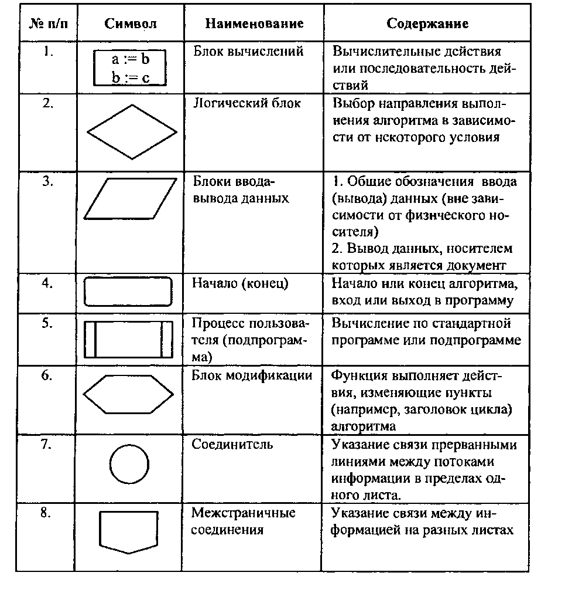
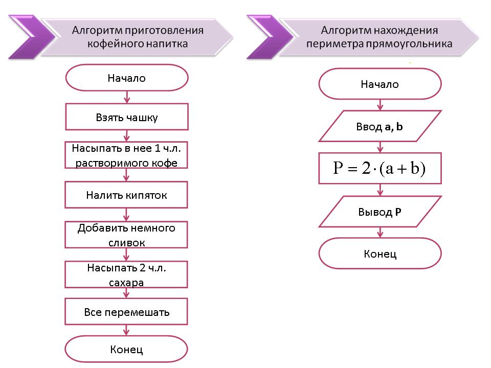
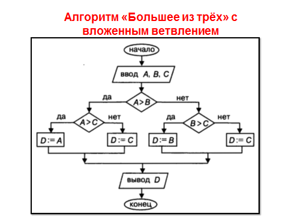
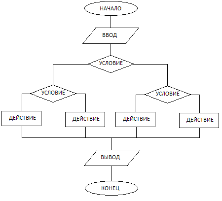
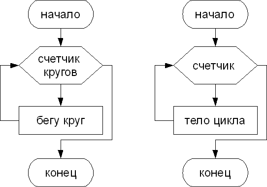
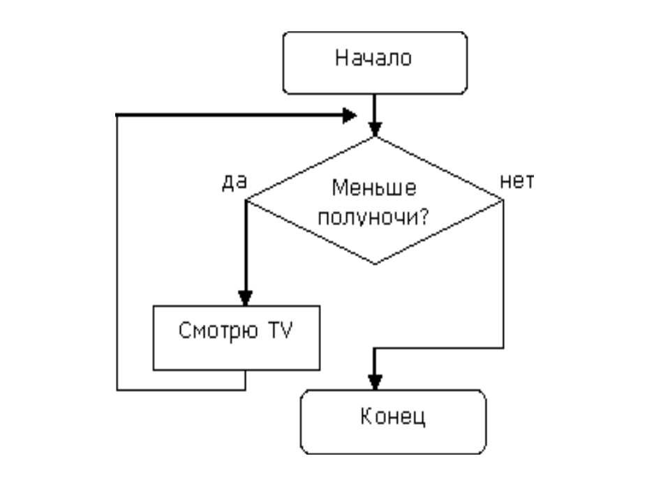
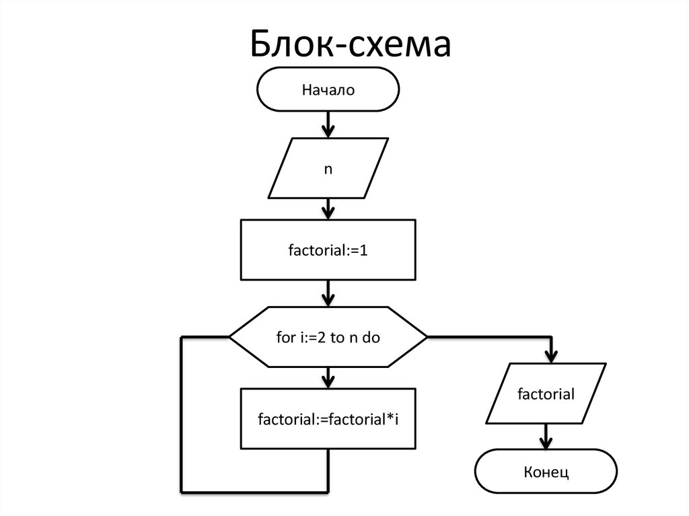
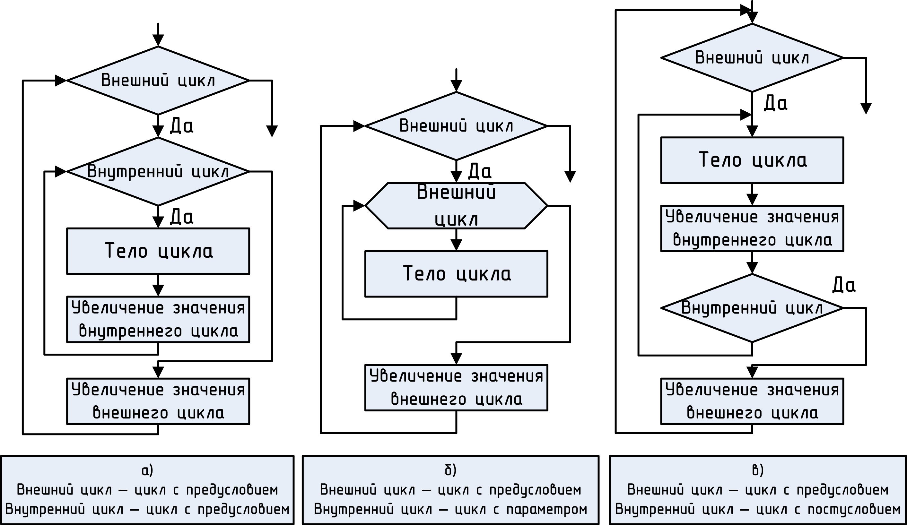

# Блок-схемы и с чем их едят  
«Основная теорема программирования: любую программу можно написать, используя три канонические структуры (линейную, условную, циклическую)...»

## Основные элементы блок-схем

Смотрите на эту картинку перед сном и никогда не забывайте, из чего состоят блок-схемы:

## Парочка примеров для понимания:

- линейные: 

- условные:

- циклические:

